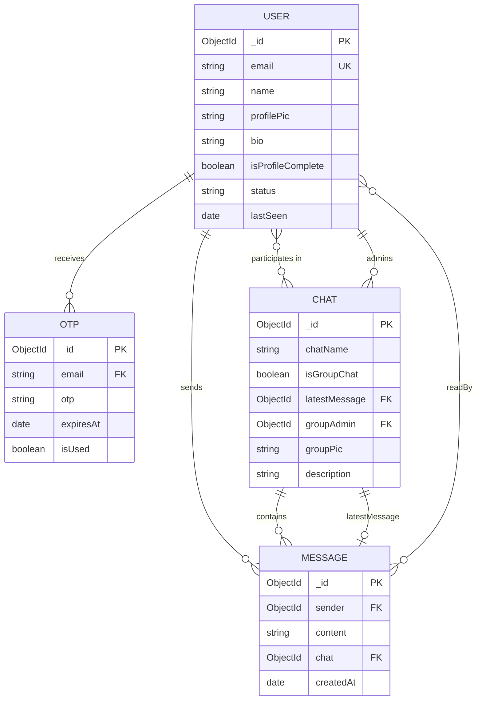

# 💬 ChatApp — Real-Time MERN Chat Application

A full-featured, production-ready real-time chat application built with the MERN stack and Socket.io. Supports one-to-one and group messaging, OTP-based passwordless authentication, and live online/offline status.

---

## ✨ Features

### 🔐 Authentication
- Passwordless login using **Email + OTP** (no passwords stored!)
- JWT stored in **HTTP-only cookies** (secure against XSS attacks)
- Auto session restore on page refresh
- Profile setup on first login (name, bio, profile picture)

### 💬 Messaging
- **One-to-one** and **Group chat** support
- Real-time messaging powered by **Socket.io**
- Message history persisted in **MongoDB**
- **Date separators** (Today / Yesterday / date)
- Grouped consecutive messages from the same sender
- Message **timestamps**
- **Read receipts** (✓ sent, ✓✓ blue = read)
- **Typing indicator** with animated bouncing dots

### 👥 User Features
- Search users by name or email
- Start a new chat instantly from search results
- Create group chats with custom name and multiple members
- **Real-time online/offline status**
- **Real-time last seen** (updates without page refresh)
- Profile picture upload

### 🎨 UI/UX
- WhatsApp-inspired dot grid chat background
- Responsive and clean design with **Tailwind CSS**
- Message bubbles with smooth rounded corners
- Avatar shown only on last message in a group (clean grouping)
- Sender name shown in group chats
- Auto-scroll to latest message

---

## 🛠️ Tech Stack

| Layer | Technology |
|---|---|
| Frontend | React 19, Vite, Tailwind CSS v4 |
| Backend | Node.js, Express.js |
| Database | MongoDB, Mongoose |
| Real-time | Socket.io |
| Auth | JWT (HTTP-only cookies), OTP via Nodemailer |
| File Upload | Multer |
| Icons | React Icons |
| HTTP Client | Axios |

---

## 📁 Project Structure

```
chat-app/
├── backend/
│   ├── config/
│   │   └── db.js                  # MongoDB connection
│   ├── controllers/
│   │   ├── authController.js      # OTP, JWT, profile
│   │   ├── chatController.js      # Create/fetch chats
│   │   ├── messageController.js   # Send/fetch/read messages
│   │   ├── uploadController.js    # Image upload
│   │   └── userController.js      # Search users
│   ├── middleware/
│   │   ├── authMiddleware.js      # JWT protection
│   │   └── upload.js              # Multer config
│   ├── models/
│   │   ├── User.js                # User schema
│   │   ├── Otp.js                 # OTP schema
│   │   ├── Chat.js                # Chat schema (1-1 + group)
│   │   └── Message.js             # Message schema
│   ├── routes/
│   │   ├── authRoutes.js
│   │   ├── chatRoutes.js
│   │   ├── messageRoutes.js
│   │   ├── uploadRoutes.js
│   │   └── userRoutes.js
│   ├── socket/
│   │   └── socketHandler.js       # All socket.io events
│   ├── uploads/                   # Stored profile images
│   ├── utils/
│   │   ├── generateOtp.js
│   │   ├── generateToken.js
│   │   └── sendEmail.js
│   └── server.js
│
└── frontend/
    └── src/
        ├── api/
        │   └── api.js             # Axios instance
        ├── components/
        │   ├── ChatWindow.jsx     # Main chat area
        │   ├── MessageBubble.jsx  # Individual message
        │   ├── Sidebar.jsx        # Chat list + search
        │   ├── TopBar.jsx         # Chat header + status
        │   └── UserCard.jsx
        ├── context/
        │   ├── AuthContext.jsx    # Global auth state
        │   └── ChatContext.jsx    # Global chat + socket state
        ├── pages/
        │   ├── Login.jsx          # Email + OTP login
        │   ├── SetupProfile.jsx   # First-time profile setup
        │   ├── Chat.jsx           # Main chat page
        │   └── Settings.jsx
        ├── routes/
        │   ├── Router.jsx         # App routes
        │   └── ProtectedRoute.jsx # Auth guard
        └── socket/
            └── socket.js          # Socket.io client
```

---

## 🔌 API Endpoints

### Auth
| Method | Endpoint | Description | Protected |
|---|---|---|---|
| POST | `/api/auth/send-otp` | Send OTP to email | No |
| POST | `/api/auth/verify-otp` | Verify OTP + issue JWT | No |
| PUT | `/api/auth/complete-profile` | Save name, bio, photo | Yes |
| GET | `/api/auth/me` | Get logged-in user | Yes |
| POST | `/api/auth/logout` | Clear JWT cookie | Yes |

### Chats
| Method | Endpoint | Description | Protected |
|---|---|---|---|
| POST | `/api/chats` | Create or access 1-1 chat | Yes |
| GET | `/api/chats` | Get all my chats | Yes |
| POST | `/api/chats/group` | Create group chat | Yes |

### Messages
| Method | Endpoint | Description | Protected |
|---|---|---|---|
| POST | `/api/messages` | Send a message | Yes |
| GET | `/api/messages/:chatId` | Get chat history | Yes |
| PUT | `/api/messages/read/:chatId` | Mark messages as read | Yes |

### Users
| Method | Endpoint | Description | Protected |
|---|---|---|---|
| GET | `/api/users/search?query=` | Search users | Yes |

### Upload
| Method | Endpoint | Description | Protected |
|---|---|---|---|
| POST | `/api/upload` | Upload profile image | Yes |

---

## ⚡ Socket.io Events

| Event | Direction | Description |
|---|---|---|
| `user_online` | Client → Server | User comes online |
| `online_users` | Server → Client | Broadcast online users list |
| `user_last_seen` | Server → Client | Broadcast lastSeen on disconnect |
| `join_chat` | Client → Server | Join a chat room |
| `send_message` | Client → Server | Send a message |
| `receive_message` | Server → Client | Receive new message |
| `typing` | Client → Server | User is typing |
| `stop_typing` | Client → Server | User stopped typing |
| `messages_read` | Client → Server | Mark messages as read |

---

## 🚀 Getting Started

### Prerequisites
- Node.js v18+
- MongoDB (local or Atlas)
- Gmail account with App Password

### 1. Clone the repository

```bash
git clone https://github.com/yourusername/chat-app.git
cd chat-app
```

### 2. Setup Backend

```bash
cd backend
npm install
```

Start backend:
```bash
npm run dev
```

### 3. Setup Frontend

```bash
cd frontend
npm install
npm run dev
```

### 4. Open the app

```
Frontend: http://localhost:5173
Backend:  http://localhost:5000
```

---

## 🔐 How Auth Works

```
1. User enters email
2. OTP sent to their inbox via Nodemailer
3. User enters OTP → verified against hashed version in DB
4. JWT issued → stored in HTTP-only cookie (XSS-safe)
5. New user → redirected to /profile to complete setup
6. Existing user → redirected to /chat
7. On refresh → /auth/me called to restore session from cookie
```

---

## 🗄️ Database Schema (ER Diagram)



> 💡 Mermaid diagrams render automatically on GitHub!

---

## 🎯 Key Concepts Implemented

- **Passwordless Auth** — OTP proves email ownership, no password needed
- **JWT in HTTP-only cookies** — prevents XSS token theft
- **Socket.io rooms** — each chat has its own room for targeted broadcasts
- **MongoDB referencing** — messages reference users/chats by ObjectId (not embedded)
- **Populate** — Mongoose populate fetches full user/message objects from IDs
- **Race condition fix** — loading state prevents premature auth redirects
- **Real-time last seen** — Socket.io broadcasts lastSeen timestamp on disconnect

---

## 👨‍💻 Author

**Amir Sohail**
- B.Tech CSE — 7th Semester
- Full Stack Developer (MERN)
- GitHub: [@amirsohail121](https://github.com/amirsohail121)

---

## 📄 License

This project is for Personal(educational) and portfolio purposes.
